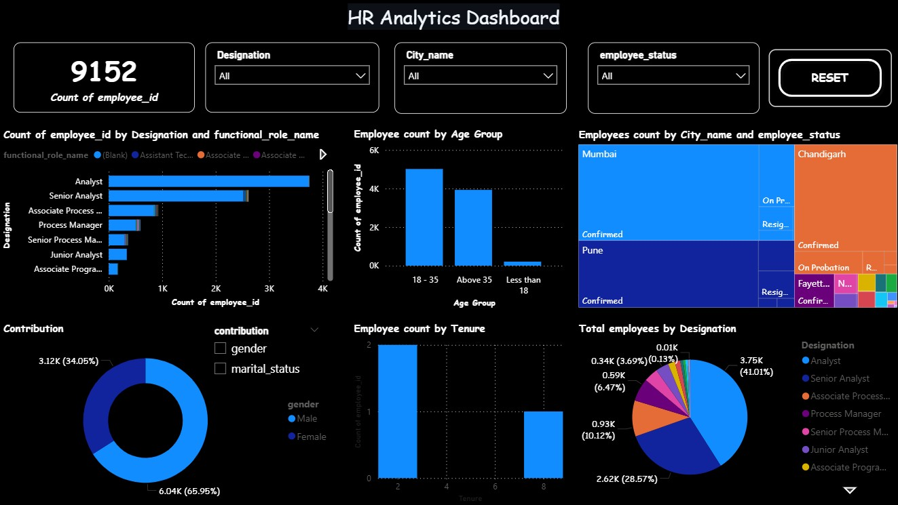
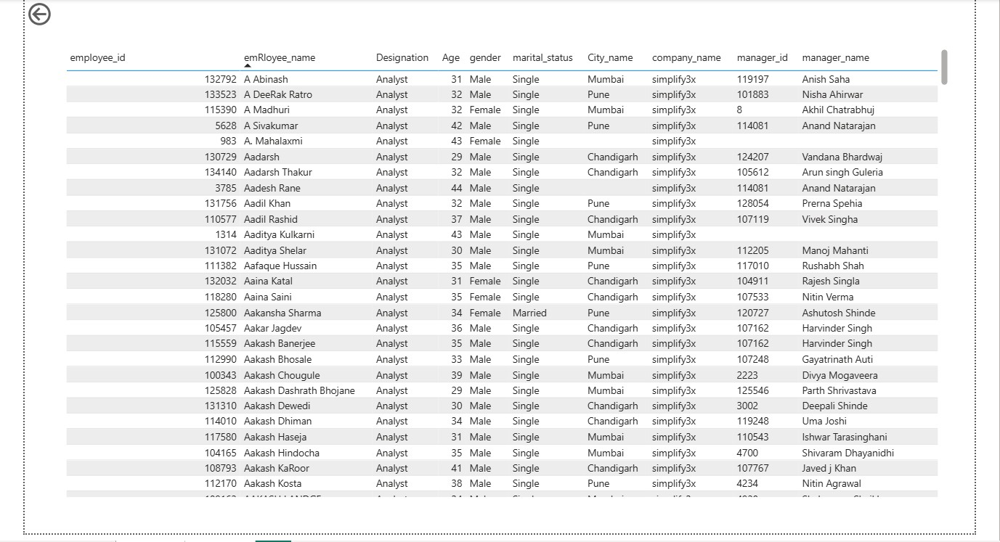
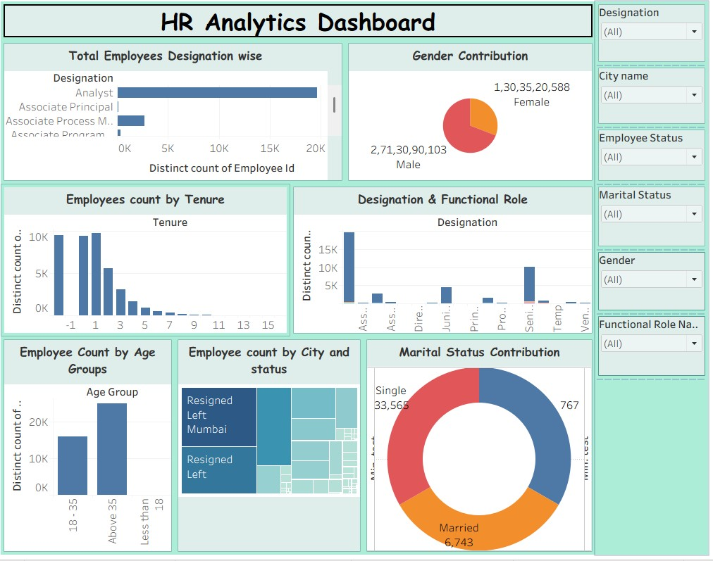

# Interactive HR Analytics Dashboard

## 📊 Project Overview
The Interactive HR Analytics Dashboard is a data visualization project built using **Power BI and Tableau** to analyze employee workforce data and generate insights into employee demographics, tenure, roles, and organizational distribution.

This dashboard enables HR teams and management to make data-driven workforce decisions by exploring employee trends across multiple dimensions such as designation, age group, gender, marital status, and location.

---

## 🛠 Tools & Technologies
- Power BI
- Tableau
- DAX (Data Analysis Expressions)
- Data Modeling
- Excel Dataset

---

## 📌 Key Features
- Interactive HR dashboard with dynamic filtering
- KPI visualization for workforce insights
- Drill-through functionality for detailed employee data
- Cross-highlighting across visuals
- Bookmark navigation for better user experience
- Dynamic slicers for real-time filtering

---

## 📈 Dashboard Insights

### 1️⃣ Total Employees
Displays the total number of employees in the organization.

### 2️⃣ Designation-wise Employee Distribution
Breakdown of employees based on their job roles such as:
- Analyst
- Senior Analyst
- Process Manager
- Associate roles

### 3️⃣ Employee Count by Tenure
Shows how employees are distributed based on their tenure in the organization.

### 4️⃣ Employee Distribution by City and Status
Treemap visualization representing employee distribution across different cities along with employment status.

### 5️⃣ Designation and Functional Role
Shows the relationship between job designation and functional roles in the organization.

### 6️⃣ Employee Count by Age Group
Age-based segmentation of employees such as:
- Less than 18
- 18–35
- Above 35

### 7️⃣ Gender Contribution
Breakdown of workforce by gender to understand diversity distribution.

### 8️⃣ Marital Status Contribution
Shows the distribution of employees based on marital status.

---

## 📂 Project Structure

```
HR-Analytics-Dashboard
│
├── Dataset.xlsx
├── HR_Analytics_Dashboard.pbix
├── HR_Analytics_Tableau.twbx
├── screenshots
│   ├── dashboard_overview_PowerBI.jpg
│   ├── drillthrough.jpg
│   ├── dashboard_overview_Tableau.jpg
│
└── README.md

```

---

## 📷 Dashboard Preview

### Power BI Dashboard


### Power BI Drillthrough Page


### Tableau Dashboard


🔗 **View Interactive Tableau Dashboard:**  
[Open Tableau Dashboard](https://public.tableau.com/app/profile/suma.sahithi/viz/Task_17729868442990/Dashboard1?publish=yes)

## 🎯 Business Value
This dashboard helps organizations:

- Monitor workforce distribution
- Analyze employee demographics
- Identify workforce patterns
- Support HR decision-making
- Improve workforce planning

---

## 🚀 How to Use

### Power BI
1. Download the `.pbix` file
2. Open using **Power BI Desktop**
3. Refresh or connect the dataset
4. Interact with slicers and drill-through pages

### Tableau
1. Download the `.twbx` file
2. Open using **Tableau Desktop**
3. Connect the dataset if required
4. Explore interactive visualizations

---

## 👩‍💻 Author

**Sumasahithi**

- Data Analytics Enthusiast
- Skills: Python, SQL, Power BI, Tableau

---

⭐ If you found this project useful, consider giving it a star!
